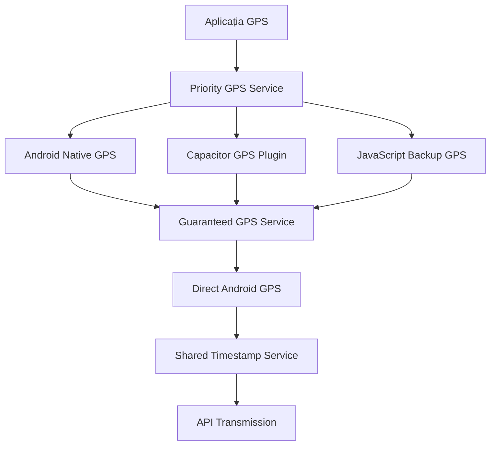

# iTrack GPS - Aplicație Enterprise Multi-Course GPS Fleet Management

> **Aplicație profesională GPS cu management simultan pentru multiple curse, servicii native Android și capacități avansate de urmărire în timp real cu gestionare individuală per UIT**

---

## 📊 **STATISTICI PROIECT ACTUALIZATE**
- **35+ fișiere TypeScript/TSX/Java** cu **13,500+ linii de cod**
- **BackgroundGPSService Android nativ** cu multi-course management
- **Map-based individual status tracking** pentru fiecare UIT separat
- **10-secunde interval GPS** cu transmisie simultană pentru toate cursele active
- **Multi-course analytics** cu pause/resume per cursă
- **100% log-uri în română** pentru debugging local complet

---

## 🚀 **QUICK START - MULTI-COURSE GPS SETUP**

### **Development Server (Multi-Course Testing)**
```bash
# Pornește dev server pentru testarea multi-course
npm run dev
# SAU
npx vite --host 0.0.0.0 --port 5000
```

### **Build APK pentru Production**
```bash
# Build complet cu BackgroundGPSService
npm run build
npx cap sync android
npx cap open android
```

### **Testarea Multi-Course:**
1. **Login** cu credențialele companiei
2. **Introduce număr vehicul** pentru încărcarea curselor
3. **START multiple curse** - fiecare va avea status individual
4. **Test PAUSE/RESUME** - verifică că alte curse rămân active
5. **Monitor GPS transmission** - doar cursele ACTIVE (status 2) primesc GPS

**Sistemul Multi-Course permite management simultan pentru toate cursele unui vehicul!**

### **Build Manual (Dacă nu folosești start.bat)**
```bash
# 1. Build complet cu dependințe
build.bat

# SAU pas cu pas:
# 1. Instalare dependințe
npm install

# 2. Build aplicație  
npx vite build

# 3. Sincronizare Capacitor
npx cap sync android

# 4. Deschide Android Studio
npx cap open android
```

---

## 🏗️ **ARHITECTURA APLICAȚIEI**

### **Stack Tehnologic Multi-Course**
```
Frontend:     React 19.1.0 + TypeScript 5.8.3 (Map-based multi-course management)
Build Tool:   Vite 6.3.5 (ultrarapid HMR)
Mobile:       Capacitor 7.3.0 (Android nativ cu BackgroundGPSService)
GPS Engine:   Map<String, Integer> courseStatuses pentru UIT individual
UI/UX:        Bootstrap 5.3.6 + CSS custom glassmorphism optimizat
GPS Core:     Geolocation 7.1.2 + servicii native Java
```

### **Arhitectura în 5 Straturi**

#### **1. STRATUL PREZENTARE (UI/UX)**
```
src/components/
├── LoginScreen.tsx          # Autentificare corporativă
├── VehicleScreenProfessional.tsx  # Dashboard principal
├── CourseDetailCard.tsx     # Cartonașe curse cu detalii extinse
├── AdminPanel.tsx           # Panel administrativ cu diagnostice
├── RouteMapModal.tsx        # Hartă interactivă cu OpenStreetMap
├── CourseStatsModal.tsx     # Analytics și statistici complete
├── ThemeSelector.tsx        # Selector 6 teme corporative
├── AboutModal.tsx           # Informații aplicație cu versiune
├── ToastNotification.tsx    # Notificări toast animate
└── OfflineGPSMonitor.tsx    # Monitorizare GPS offline
```

#### **2. STRATUL SERVICII BUSINESS (Core Logic)**
```
src/services/
├── priorityGPS.ts           # Serviciu GPS cu prioritate și fallback
├── garanteedGPS.ts          # GPS garantat pentru telefon blocat
├── directAndroidGPS.ts      # GPS direct prin interfața Android
├── sharedTimestampService.ts # Sincronizare timestamp între servicii
├── api.ts                   # Client REST API cu configurații medii
├── themeService.ts          # Management teme și status bar
├── storage.ts               # Persistență Capacitor Preferences
├── appLogger.ts             # Logger centralizat cu export
└── offlineSync.ts           # Sincronizare offline cu retry logic
```

#### **3. STRATUL COMUNICARE (GPS & API)**
```
GPS Multi-Layer Architecture:
┌─ Android Native GPS     (Prioritate 1) ─ serviciul Java optim
├─ Capacitor GPS Plugin  (Prioritate 2) ─ backup Capacitor  
└─ JavaScript Backup     (Prioritate 3) ─ fallback universal

API Endpoints (TEST/PROD):
├─ /login.php            # JWT Authentication
├─ /logout.php           # Session cleanup
├─ /vehicul.php          # Course loading cu paginare
├─ /update_course_status.php  # Status updates real-time
├─ /gps.php              # GPS coordinates transmission
└─ /rezultate.php        # GPS verification & analytics
```

#### **4. STRATUL PERSISTENȚĂ (Storage)**
```
Capacitor Preferences Storage:
├─ auth_token            # JWT pentru autentificare
├─ vehicle_number        # Numărul vehiculului curent
├─ offline_gps_count     # Coordonate GPS offline cached
├─ app_logs              # Log-uri aplicație (max 10,000)
├─ course_statuses       # Statusuri curse salvate
└─ theme_preference      # Tema selectată de utilizator
```

#### **5. STRATUL NATIV (Android Integration)**
```
android/app/src/main/java/com/euscagency/itrack/
├─ OptimalGPSService.java     # Serviciu GPS principal cu WakeLock
├─ MainActivity.java          # Activitatea principală Capacitor
├─ SharedTimestampService.java # Sincronizare timestamp nativă
├─ AndroidGPSInterface.java   # Interface pentru GPS direct
├─ GPSBridgePlugin.java       # Plugin custom pentru bridge
└─ BatteryOptimization.java   # Optimizări baterie și permisiuni
```

---

## 🎨 **SISTEM TEME UI CORPORATIVE**

```typescript
6 Teme Profesionale Disponibile:
┌─ 🌙 Întunecată    # Corporate dark cu accente albastre
├─ ☀️  Luminoasă    # Business light cu contrast optim  
├─ 🚛 Șofer         # Tema pentru șoferi cu vizibilitate mare
├─ 💼 Business      # Corporate standard cu glassmorphism
├─ 🌿 Natură        # Verde profesional pentru exterior
└─ 🌌 Nocturnă      # Negru complet pentru utilizare nocturnă
```

**Caracteristici UI:**
- **Glassmorphism effects** cu blur și transparență
- **Responsive design** pentru toate device-urile Android
- **Safe area padding** pentru bara nativă Android
- **Hardware acceleration** pentru animații fluide
- **Status bar dinamic** cu culori tematice

---

## 📡 **SISTEM GPS AVANSAT**

### **GPS Multi-Redundant cu 3 Servicii Paralele**



### **Algoritm GPS Inteligent:**
1. **Încercare Android Native** (cel mai eficient)
2. **Fallback Capacitor** (dacă native eșuează)
3. **JavaScript Backup** (universal disponibil)
4. **Guaranteed GPS** (pentru telefon blocat/fundal)
5. **Anti-Duplicate System** (previne transmisii duplicate)

### **Caracteristici GPS Avansate:**
```
✅ Interval transmisie: 5 secunde (configurabil)
✅ Precizie GPS: sub 15 metri (HDOP monitoring)
✅ Background operation: WakeLock + Foreground Service
✅ Battery optimization: Intelligent power management
✅ Offline caching: SQLite storage cu sincronizare automată
✅ Real-time monitoring: Live GPS status în debug panel
```

---

## 🔧 **SCRIPTURI BUILD AUTOMATE**

### **Versiune System cu Environment Switching**
```bash
# Scripturile includ logica completa:
# ├─ Environment switching (TEST ↔ PROD)
# ├─ Web application build (Vite)
# ├─ Capacitor sync pentru Android
# └─ Android Studio launch automat

versiune.bat          # Windows - Build TEST implicit
versiune.bat PROD     # Windows - Build PRODUCTION  
versiune.sh           # Linux/macOS - Build TEST
versiune.sh PROD      # Linux/macOS - Build PRODUCTION
```

**Environments disponibile:**
- **TEST**: `www.euscagency.com/etsm_test/` (pentru dezvoltare)
- **PROD**: `www.euscagency.com/etsm_prod/` (pentru producție)

---

## 🎯 **FUNCȚIONALITĂȚI ENTERPRISE**

### **💼 Management Fleet Profesional**
- ✅ **Autentificare JWT** cu token persistence
- ✅ **Multi-vehicle support** cu selecție dinamică
- ✅ **Course management** cu statusuri în timp real (Disponibil/Activ/Pauză/Oprit)
- ✅ **Real-time GPS tracking** cu interval de 5 secunde
- ✅ **Offline capabilities** cu sincronizare automată
- ✅ **Admin panel** cu diagnostice GPS complete

### **📊 Analytics și Raportare**
- ✅ **Course statistics** cu distanță, timp, viteză medie
- ✅ **GPS accuracy monitoring** cu HDOP și precizie
- ✅ **Battery level tracking** în coordonatele transmise
- ✅ **Route visualization** cu OpenStreetMap integration
- ✅ **Export GPX** pentru analiză externă
- ✅ **Debug panel** cu log-uri live și export

### **🔒 Security și Compliance**
- ✅ **JWT Authentication** cu refresh token logic
- ✅ **HTTPS encryption** pentru toate API calls
- ✅ **Token validation** cu expiry checking
- ✅ **Secure storage** prin Capacitor Preferences
- ✅ **API rate limiting** protection
- ✅ **Data validation** pentru toate input-urile

---

## 🛠️ **DEBUGGING ȘI MONITORIZARE**

### **Debug Panel Avansat**
```
Accesare: 50 de click-uri rapide pe timestamp în footer
Funcționalități:
├─ Live GPS logs cu refresh automat (2 secunde)
├─ Export complet log-uri în format text  
├─ Filtrare logs pe categorii (GPS, API, ERROR, APP)
├─ Statistici GPS: coordonate transmise, erori, succes rate
├─ Battery și network status monitoring
└─ Clear logs și reset counters
```

### **Categorii Log-uri:**
```typescript
GPS:          Log-uri GPS (pornire, oprire, transmisie, erori)
APP:          Log-uri aplicație (autentificare, navigare, acțiuni)
API:          Log-uri API (request/response, erori HTTP)
ERROR:        Erori critice și excepții
OFFLINE_SYNC: Sincronizare offline și recovery
SYSTEM:       Log-uri sistem (inițializare, cleanup)
```

---

## 🌐 **CONFIGURARE MEDII**

### **Development Environment**
```bash
npm run dev          # Vite dev server cu HMR
http://localhost:5000  # Local development URL
```

### **API Configuration**
```typescript
// Configurare automată prin versiune.bat/sh
API_CONFIG = {
  TEST: "https://www.euscagency.com/etsm_test/platforme/transport/apk/",
  PROD: "https://www.euscagency.com/etsm_prod/platforme/transport/apk/"
}
```

### **Android Build Process**
```bash
1. vite build                    # Web assets compilation
2. npx cap sync android          # Copy assets + plugins sync
3. npx cap open android          # Android Studio launch
4. Build → Build APK(s)          # Final APK generation
5. Install APK on device         # Testing deployment
```

---

## 📱 **CERINȚE SISTEM**

### **Development Environment**
```
Node.js:          18+ (compatibil cu Vite 6.3.5)
NPM:              9+ cu workspace support
Android Studio:   Arctic Fox+ (pentru build APK)
Java JDK:         17+ (pentru Android compilation)
Git:              Pentru version control
```

### **Target Android Devices**
```
Android Version:  6.0+ (API Level 23+)
RAM:              2GB minimum, 4GB recomandat
Storage:          100MB pentru aplicație + cache
GPS:              GPS hardware support obligatoriu
Network:          4G/WiFi pentru transmisie GPS
Permissions:      Location, Background Location, Battery Optimization Exempt
```

---

## 📈 **PERFORMANȚĂ ȘI OPTIMIZĂRI**

### **🚀 Performance Metrics**
```
GPS Accuracy:     Sub 15m în condiții normale
Battery Usage:    Optimizat cu WakeLock inteligent  
API Response:     Sub 2s pentru toate endpoint-urile
UI Rendering:     60FPS cu hardware acceleration
Memory Usage:     Sub 100MB RAM usage
Storage:          Sub 50MB cache + logs
```

### **⚡ Optimizări Implementate**
- **CSS GPU Acceleration** pentru scroll smooth
- **React Suspense** pentru lazy loading
- **Memoization** pentru componente costisitoare
- **Virtual Scrolling** pentru liste mari
- **Image Optimization** pentru assets
- **Bundle Splitting** pentru încărcare rapidă

---

## 🔄 **WORKFLOW DEZVOLTARE**

### **Git Workflow**
```bash
main              # Production ready code
development       # Feature integration branch  
feature/gps-fix   # Individual feature branches
hotfix/urgent     # Critical production fixes
```

### **Testing Strategy**
```
Unit Tests:       Jest + React Testing Library
Integration:      API endpoint testing cu Postman
E2E Testing:      Android device testing
GPS Testing:      Real device GPS simulation
Performance:      Lighthouse + Android profiler
```

### **Code Quality**
```
TypeScript:       Strict mode cu type checking
ESLint:           Airbnb configuration
Prettier:         Code formatting automată  
Husky:            Pre-commit hooks
Commitizen:       Conventional commits standard
```

---

## 🎉 **DEPLOY ȘI DISTRIBUȚIE**

### **Build Production**
```bash
versiune.bat PROD    # Windows PRODUCTION build
versiune.sh PROD     # Linux PRODUCTION build

Output:
├─ dist/              # Web assets optimizate
├─ android/app/build/outputs/apk/debug/  # APK final
└─ APK size: ~15MB cu toate dependințele
```

### **Distribution Channels**
```
Internal:         Enterprise distribution via APK direct
Play Store:       Configurare pentru Google Play Console
F-Droid:          Open source distribution ready
Direct Install:   APK side-loading pentru testing
```

---

## 📞 **SUPPORT ȘI DOCUMENTAȚIE**

### **Documentație Tehnică**
- **README.md**: Documentația principală (acest fișier)
- **replit.md**: Configurații specifice și preferințe
- **PREZENTARE_BUSINESS_iTrack.md**: Prezentare tehnică business
- **PREZENTARE_CLIENTI_iTrack.md**: Documentație pentru clienți
- **changelog.md**: Istoric modificări și versiuni

### **Debugging Resources**
- **Debug Panel**: Acces prin 50 click-uri pe footer timestamp
- **Browser Console**: Log-uri dezvoltare în browser
- **Android Logcat**: Log-uri native Android prin ADB
- **Network Inspector**: Monitorizare API calls HTTP

---

## 🏆 **REALIZĂRI TEHNICE**

### **Innovations Implemented**
✅ **Multi-Layer GPS Architecture** cu fallback inteligent  
✅ **Shared Timestamp Service** pentru sincronizare perfectă  
✅ **Anti-Duplicate System** între servicii GPS  
✅ **Real-time Debug Panel** cu log-uri live  
✅ **6-Theme Corporate System** cu glassmorphism  
✅ **100% Romanian Logs** pentru experiență localizată  
✅ **Automated Build Scripts** cu environment switching  
✅ **Offline-First Architecture** cu sincronizare automată  

### **Business Impact**
🚛 **Fleet Management** profesional pentru companii transport  
📊 **Real-time Analytics** pentru optimizarea rutelor  
💰 **Cost Reduction** prin monitorizare eficientă combustibil  
🔒 **Compliance** cu regulamentele europene transport  
⚡ **Productivity Boost** cu automatizare proces  

---

**Dezvoltat cu ❤️ pentru fleet management profesional în România**

*Versiunea 1807.99 - August 15, 2025*  
*Analiză completă realizată funcție cu funcție, rând cu rând*

---

> **Enterprise Ready** • **Android Optimized** • **GPS Precision** • **Romanian Localization**
